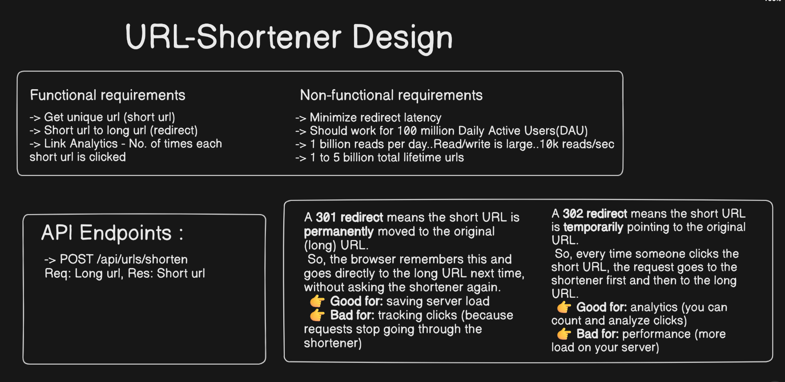
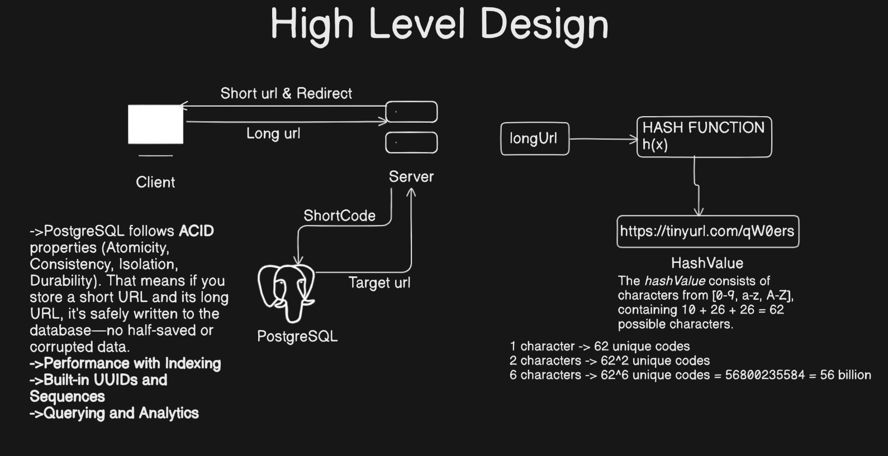
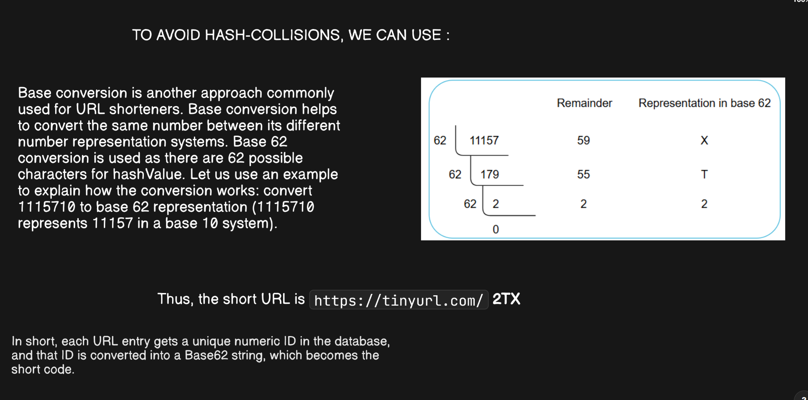
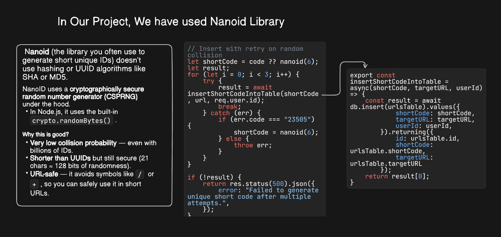
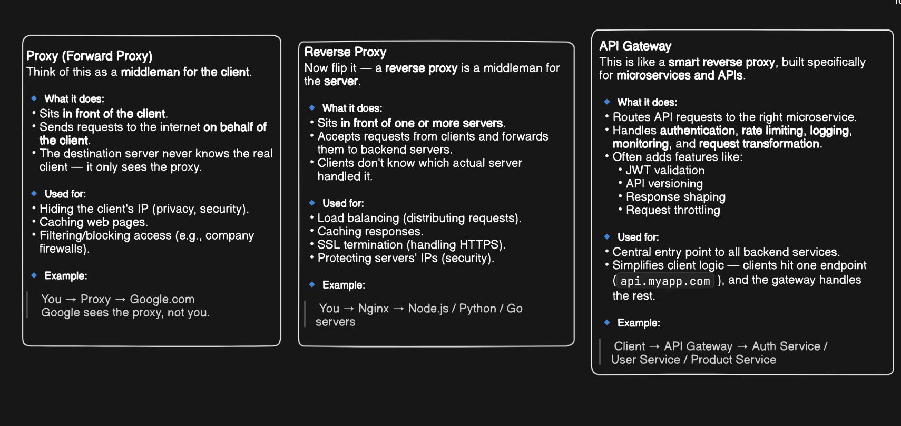
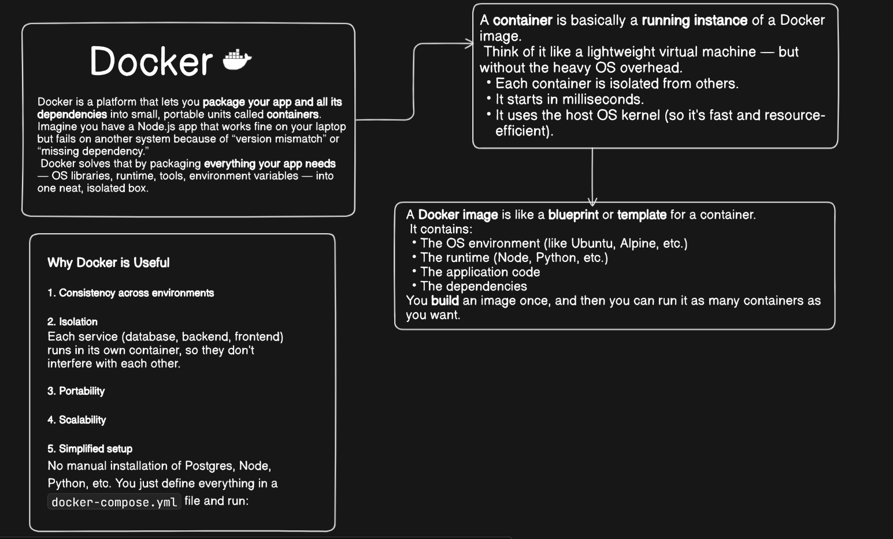
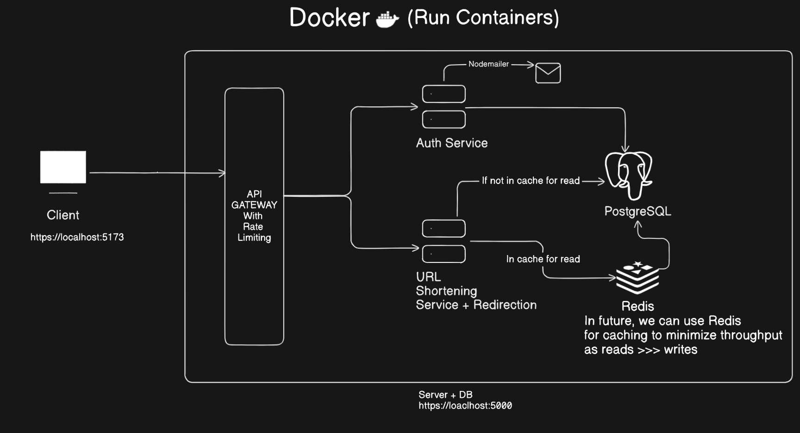
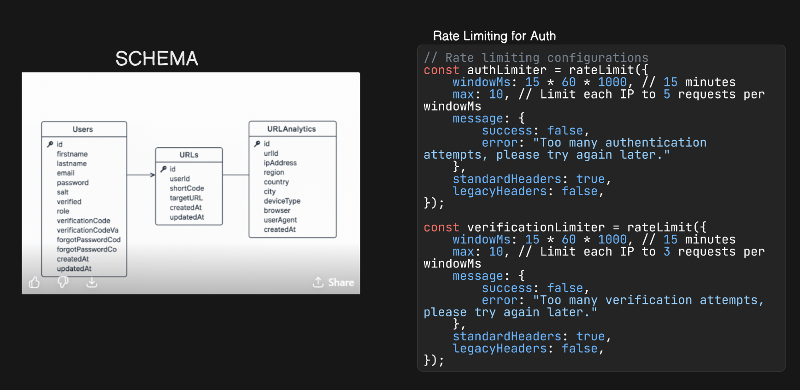
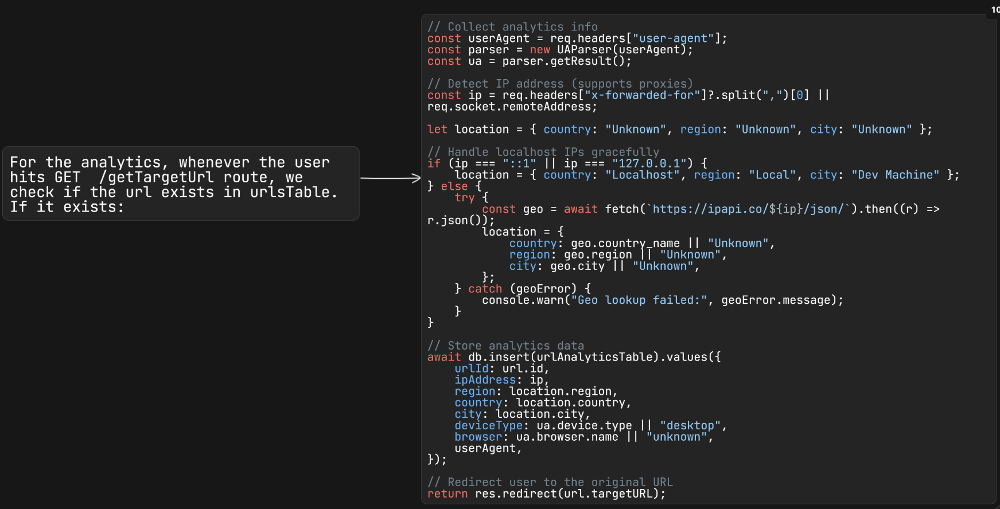
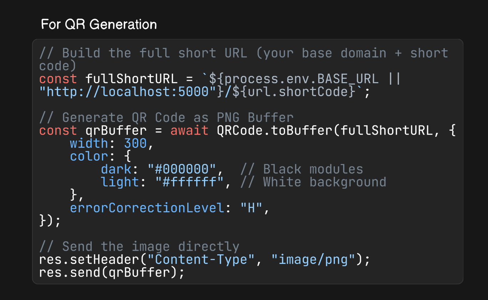

## URL Shortener

A full-featured URL Shortener with authentication, analytics, and QR code generation built for modern web use.  

---

## Demo

🎬 Watch the demo video here:  
[URL Shortener Demo](https://drive.google.com/file/d/1HTfaw1APfA2tJFDsgzNwfRdnXnLqFp7V/view?usp=sharing)

---

## Tech Stack

- **Frontend:** React + TypeScript + Tailwind + Shadcn  
- **Backend:** Node.js + Express  
- **Database:** PostgreSQL via Drizzle ORM  
- **Other:** Docker, Nodemailer, Nanoid, JWT 

---

## Features

- User signup and login with rate-limited authentication  
- Send & verify email codes for signup and password recovery  
- Change password and update first/last name  
- Create, update, and delete shortened URLs  
- View all created URLs and analytics for each  
- Generate QR codes for shortened URLs  
- Redirect short URLs to their target destinations  

---

## System Design

  
  
  
  
  
  
  
  
  

